# CASOS DE USO CON DIAGRAMAS MERMAID
## Sistema Intranet Aduni Vallejo

> **Version vigente (9.3):** Para modelamiento del sistema, diagramas por actor y flujos de eventos (Tablas 7-9), consultar [`docs/9.3_modelamiento_sistema.md`](../docs/9.3_modelamiento_sistema.md) y la carpeta [`bocectos_adva/9.3/`](9.3/). Este archivo se mantiene como referencia detallada por modulo; las secciones **PAG** y **SIM** fueron actualizadas al codigo actual (2026).

Basado en: `funcionalidades_por_modulo_y_actores.txt`
Formato: `graph LR` (compatible con todas las versiones de Mermaid)

---

## ACTORES DEL SISTEMA

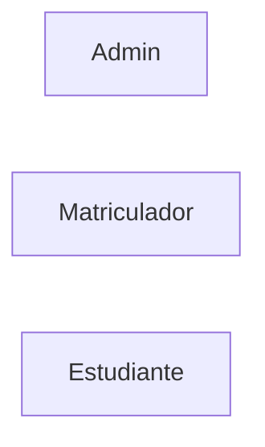

| Actor | Descripcion |
|-------|-------------|
| Admin | Gestiona operaciones administrativas y academicas totales |
| Matriculador | Opera el flujo academico y administrativo diario |
| Estudiante | Consulta informacion personal y academica |

---

## MODULO: MATRICULA (MAT)

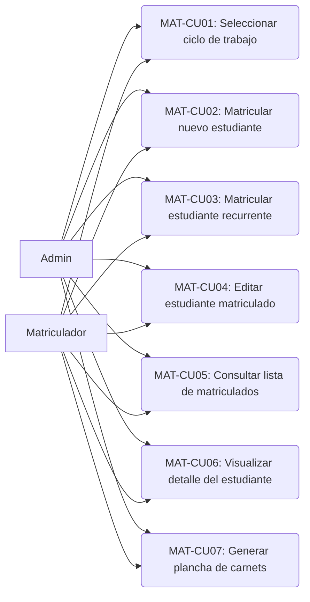

### MAT-CU01: Seleccionar ciclo de trabajo
**Actores:** Admin, Matriculador
**Descripcion:** El usuario selecciona el ciclo academico activo sobre el cual realizara las operaciones.
**Precondicion:** Sesion iniciada. Existe al menos un ciclo.
**Postcondicion:** Carga automatica del ultimo ciclo operable.
**Flujo Principal:**
1. Usuario ingresa al modulo de Matricula.
2. Sistema detecta y carga el ciclo activo.
3. Sistema muestra el nombre del ciclo seleccionado.
4. Usuario puede cambiar de ciclo.
5. Sistema actualiza la lista segun el ciclo.
**FA (Sin ciclo):** Mensaje y redirige a creacion.
**FA (Fuera de periodo):** Bloquea escritura.

### MAT-CU02: Matricular nuevo estudiante
**Actores:** Admin, Matriculador
**Descripcion:** Registra un nuevo estudiante y lo matricula en el ciclo activo.
**Precondicion:** Ciclo activo en periodo operable. DNI no existe.
**Postcondicion:** Se crea User + StudentProfile + CycleEnrollment.
**Flujo Principal:**
1. Usuario hace clic en "Nuevo Estudiante".
2. Sistema muestra formulario.
3. Ingresa datos personales, academicos, apoderado.
4. Sistema valida DNI (8 digitos unico) y email.
5. Crea registros.
6. Notifica exito.
**FA (DNI duplicado):** Redirige a recurrente.
**FA (Error validacion):** Muestra error.

### MAT-CU03: Matricular estudiante recurrente
**Actores:** Admin, Matriculador
**Descripcion:** Re-matricula a estudiante existente en nuevo ciclo.
**Precondicion:** User existe por DNI. Sin matricula en ciclo activo.
**Postcondicion:** CycleEnrollment creado.
**Flujo Principal:**
1. Ingresa DNI.
2. Sistema busca y muestra datos.
3. Usuario confirma.
4. Sistema crea matricula.
**FA (Ya matriculado):** Error.

### MAT-CU04: Editar estudiante matriculado
**Actores:** Admin, Matriculador
**Precondicion:** Ciclo en periodo operable. Estudiante matriculado.
**Postcondicion:** Campos actualizados.
**Flujo Principal:**
1. Busca estudiante.
2. Muestra detalle.
3. Modifica campos.
4. Valida y guarda.

### MAT-CU05: Consultar lista de matriculados
**Actores:** Admin, Matriculador
**Descripcion:** Visualiza lista con busqueda y filtrado.
**Precondicion:** Ciclo activo.
**Postcondicion:** Tabla cargada.
**Flujo Principal:**
1. Sistema carga estudiantes.
2. Muestra tabla: DNI, nombres, modalidad, grupo, estado, saldo.
3. Usuario busca por DNI/nombre/apellido.
4. Filtra en tiempo real.
**FA (Sin estudiantes):** Mensaje.

### MAT-CU06: Visualizar detalle del estudiante
**Actores:** Admin, Matriculador
**Precondicion:** Estudiante existe.
**Postcondicion:** Ficha completa visible.
**Flujo Principal:**
1. Clic en estudiante.
2. Sistema muestra datos y acciones.

### MAT-CU07: Generar plancha de carnets
**Actores:** Admin, Matriculador
**Precondicion:** Estudiante(s) existen.
**Postcondicion:** PDF descargado.
**Flujo Principal:**
1. Selecciona estudiantes.
2. "Generar plancha".
3. Sistema genera PDF A4.
4. Descarga.
**FA (Individual):** Desde detalle.
**FA (Sin seleccion):** Toda la lista.

---

## MODULO: GESTION DE CICLOS (CIC)

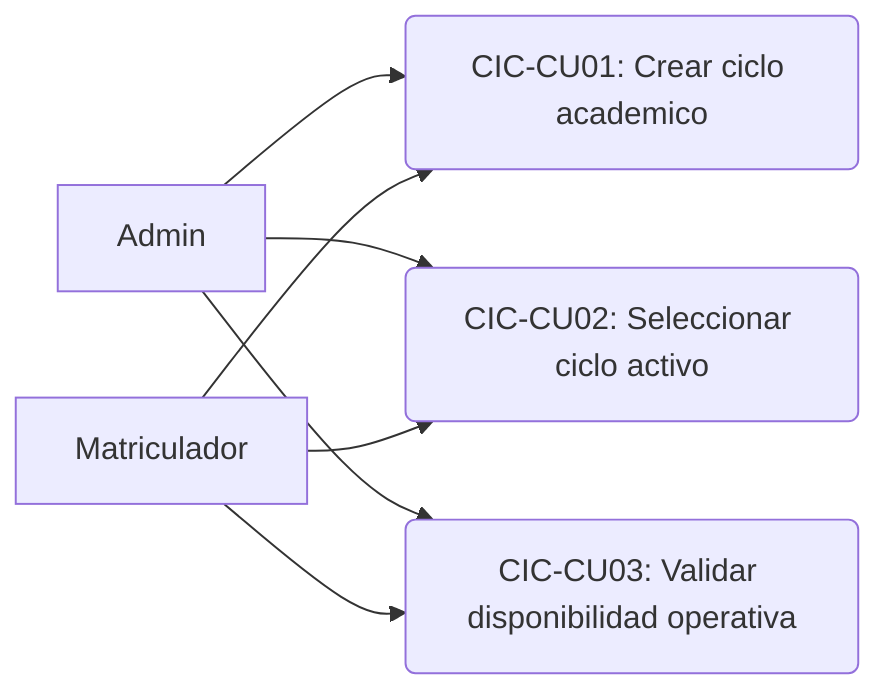

### CIC-CU01: Crear ciclo academico
**Actores:** Admin, Matriculador
**Precondicion:** Usuario autenticado.
**Postcondicion:** Cycle creado.
**Flujo Principal:**
1. Accede a crear ciclo.
2. Formulario: nombre, fecha inicio, fecha fin.
3. Valida nombre unico y fecha fin > inicio.
4. Crea.
**FA (Nombre duplicado):** Error.

### CIC-CU02: Seleccionar ciclo activo
**Actores:** Admin, Matriculador
**Precondicion:** Existe al menos un ciclo.
**Postcondicion:** Ciclo activo seleccionado.
**Flujo Principal:**
1. Abre selector.
2. Lista disponible.
3. Selecciona.
4. Guarda.
**FA (Terminado):** Solo lectura.

### CIC-CU03: Validar disponibilidad operativa
**Actores:** Sistema (transversal)
**Flujo Principal:**
1. Usuario intenta escritura.
2. Sistema verifica rango de fechas.
3. Si en periodo: permite.
**FA (Fuera):** Bloquea.

---

## MODULO: PAGOS (PAG)

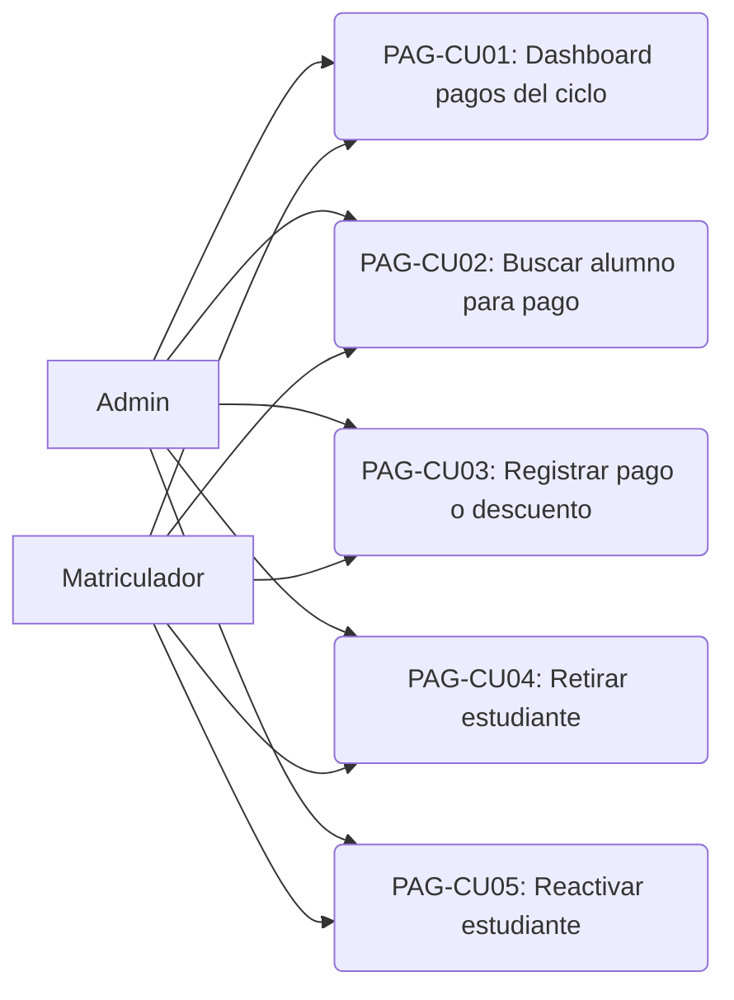

### PAG-CU01: Consultar dashboard de pagos del ciclo
**Actores:** Admin, Matriculador
**Precondicion:** Ciclo activo seleccionado (`activeCycleId`).
**Postcondicion:** KPIs e historial diario visibles.
**Flujo Principal:**
1. Ingresa a `/dashboard/pagos`.
2. Sistema carga resumen (`GET /api/payments/cycle-summary`): activos/retirados, totales a pagar y pagados.
3. Carga historial agrupado por dia (`GET /api/payments/cycle-history`).
4. Muestra buscador de alumnos y mini-tabla de estudiantes.
**FA (Sin ciclo):** Mensaje para seleccionar ciclo en Matricula.

### PAG-CU02: Buscar alumno para pago
**Actores:** Admin, Matriculador
**Precondicion:** Ciclo activo.
**Postcondicion:** Detalle financiero del alumno visible.
**Flujo Principal:**
1. Busca por DNI en autocomplete (`GET /api/payments/search`).
2. Navega a `/dashboard/pagos/alumno/:documentId`.
3. Carga resumen (`student-summary`) e historial (`history`).
**FA (No encontrado):** Sin resultados en buscador.

### PAG-CU03: Registrar pago o descuento
**Actores:** Admin, Matriculador
**Precondicion:** PaymentAgreement activo. Ciclo en periodo operable.
**Postcondicion:** Transaction creada. Saldo actualizado.
**Flujo Principal:**
1. Desde detalle alumno, registra pago (`POST /api/payments/register`) o cupon (`POST /api/payments/discount`).
2. Sistema valida monto y recibo (8 digitos).
3. Actualiza saldo pendiente e historial.
4. Refresca vista de detalle.
**FA (Retirado):** Permite registrar pago igualmente.
**FA (Desde matricula):** Pago inicial en enrollment.

### PAG-CU04: Retirar estudiante
**Actores:** Admin, Matriculador
**Precondicion:** Estudiante ACTIVE.
**Postcondicion:** User.status = RETIRED.
**Flujo Principal:**
1. Desde detalle de pagos, "Retirar".
2. Confirma.
3. `POST /api/payments/student/:userId/retire`.

### PAG-CU05: Reactivar estudiante
**Actores:** Admin, Matriculador
**Precondicion:** Estudiante RETIRED.
**Postcondicion:** User.status = ACTIVE.
**Flujo Principal:**
1. Desde detalle, "Reactivar".
2. Confirma.
3. `POST /api/payments/student/:userId/activate`.

---

## MODULO: USUARIOS (USR)

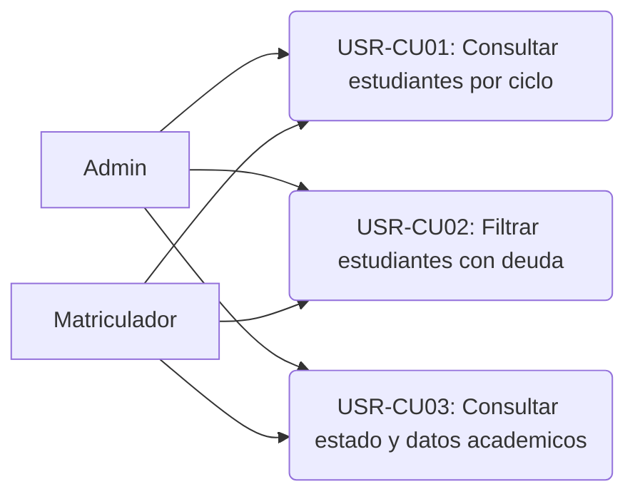

### USR-CU01: Consultar estudiantes por ciclo
**Actores:** Admin, Matriculador
**Precondicion:** Ciclo activo.
**Postcondicion:** Tabla filtrada.
**Flujo Principal:**
1. Ingresa a Usuarios.
2. Carga estudiantes.
3. Aplica filtros: modalidad, grupo, DNI, nombres, estado, deuda.
**FA (Sin resultados):** Mensaje.

### USR-CU02: Filtrar estudiantes con deuda
**Actores:** Admin, Matriculador
**Flujo Principal:**
1. Activa filtro "Con deuda".
2. Filtra saldo > 0.
3. Resalta celdas.

### USR-CU03: Consultar estado y datos academicos
**Actores:** Admin, Matriculador
**Flujo Principal:**
1. Clic en estudiante.
2. Muestra datos y saldo.

---

## MODULO: ASISTENCIA ADMINISTRATIVA (ASIS)

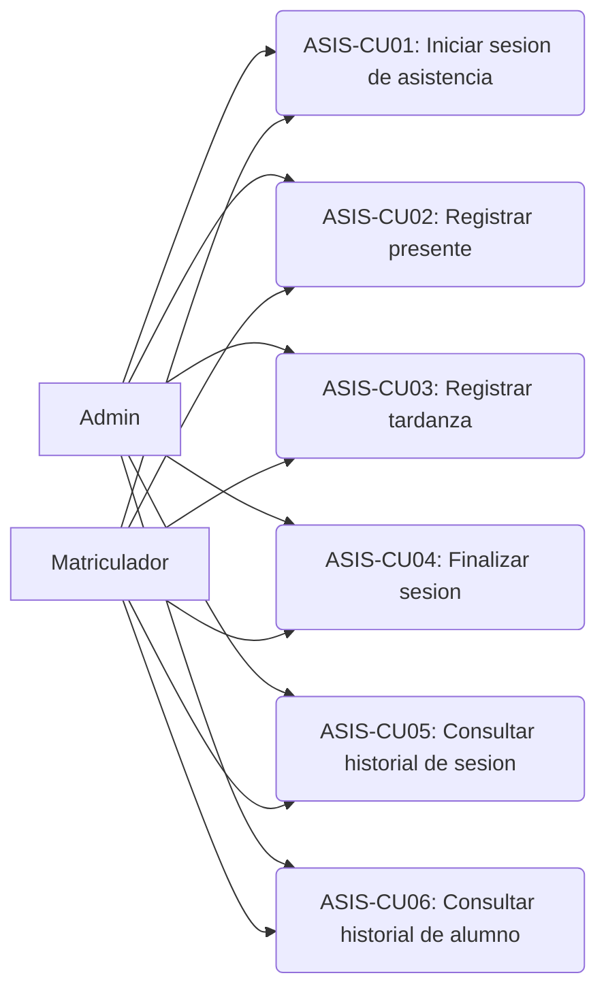

### ASIS-CU01: Iniciar sesion de asistencia
**Actores:** Admin, Matriculador
**Precondicion:** Ciclo activo. Sin sesion activa.
**Postcondicion:** AttendanceSession creada.
**Flujo Principal:**
1. Ingresa a Asistencia.
2. "Nueva sesion".
3. Sistema crea sesion.
4. Carga lista de estudiantes.
5. Muestra "Faltan" y "Ya marcaron".
**FA (Sesion en curso):** Pregunta continuar/finalizar.

### ASIS-CU02: Registrar presente
**Actores:** Admin, Matriculador
**Precondicion:** Sesion activa.
**Postcondicion:** AttendanceRecord PRESENT.
**Flujo Principal:**
1. Escanea QR.
2. Sistema registra PRESENT.
3. Sonido de exito.
4. Pasa a "Ya marcaron".
**FA (Manual):** Busqueda por DNI.
**FA (QR invalido):** Error.

### ASIS-CU03: Registrar tardanza
**Actores:** Admin, Matriculador
**Postcondicion:** Status LATE.
**Flujo Principal:**
1. Activa modo tardanzas.
2. Nuevos registros = TARDANZA.
**FA (Cambio manual):** Desde lista.

### ASIS-CU04: Finalizar sesion
**Actores:** Admin, Matriculador
**Precondicion:** Sesion activa.
**Postcondicion:** Sesion cerrada. No registrados = ABSENT.
**Flujo Principal:**
1. "Finalizar sesion".
2. Confirma.
3. Marca "Faltan" como ABSENT.
4. Cierra sesion.
5. Notifica.

### ASIS-CU05: Consultar historial de sesion
**Actores:** Admin, Matriculador
**Precondicion:** Sesion finalizada.
**Postcondicion:** Detalle de sesion.
**Flujo Principal:**
1. Selecciona sesion.
2. Muestra registros con nombre, DNI, hora, estado.
3. Estadisticas.

### ASIS-CU06: Consultar historial de alumno
**Actores:** Admin, Matriculador
**Precondicion:** Estudiante existe.
**Postcondicion:** Historial del estudiante.
**Flujo Principal:**
1. "Historial de alumno".
2. Busca por DNI.
3. Muestra sesiones y % de asistencia.

---

## MODULO: HISTORIAL PERSONAL DE ASISTENCIA (HPA)

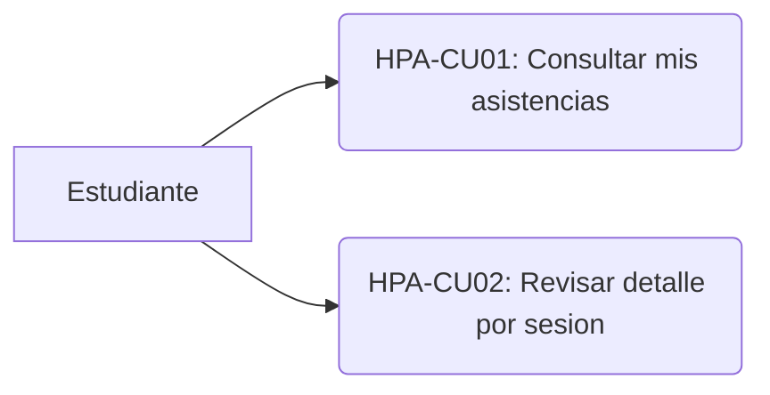

### HPA-CU01: Consultar mis asistencias
**Actores:** Estudiante
**Precondicion:** Autenticado.
**Postcondicion:** Historial cronologico.
**Flujo Principal:**
1. "Mis Asistencias".
2. Carga registros por fecha descendente.
3. Muestra: sesion, fecha, hora, estado.
**FA (Sin registros):** Mensaje.

### HPA-CU02: Revisar detalle por sesion
**Actores:** Estudiante
**Flujo Principal:**
1. Clic en sesion.
2. Muestra detalle.

---

## MODULO: SIMULACROS (SIM)

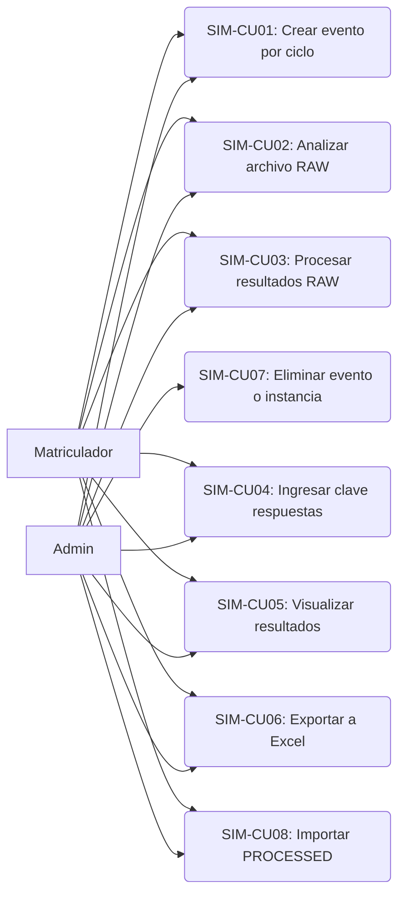

### SIM-CU01: Crear evento de simulacro
**Actores:** Admin, Matriculador
**Precondicion:** Ciclo activo seleccionado.
**Postcondicion:** SimulationEvent vinculado al ciclo (`cycleId`). Unicidad nombre por ciclo.
**Flujo Principal:**
1. Ingresa a Simulacros.
2. "Crear evento".
3. Ingresa nombre, numero de preguntas, separacion tematica opcional.
4. Confirma (`POST /api/simulations/events` con `cycleId`).
**FA (Sin nombre/ciclo):** Error 400.

### SIM-CU02: Analizar archivo RAW
**Actores:** Admin, Matriculador
**Precondicion:** Evento creado. Archivo Excel con DNI en columna A.
**Postcondicion:** Tabla de validacion visible. **No se crea instancia en BD.**
**Flujo Principal:**
1. Selecciona evento y "Subir resultados".
2. Ingresa nombre de instancia y archivo.
3. Pulsa "Analizar archivo (respuestas crudas)".
4. Frontend parsea DNI y llama `POST /api/simulations/validate-codes`.
5. Muestra estados: FOUND, NOT_FOUND, NOT_ENROLLED, INACTIVE.
**FA (Sin codigos):** Error en cliente.

### SIM-CU03: Procesar resultados RAW
**Actores:** Admin, Matriculador
**Precondicion:** Analisis previo. Clave de respuestas completa. Archivo en memoria.
**Postcondicion:** Instancia + SimulationResult + rankings (global, modalidad, grupo).
**Flujo Principal:**
1. Pulsa "Procesar y guardar resultados".
2. `POST /api/simulations/events/:id/instances/process-raw` (subida + scoring atomico).
3. Backend crea instancia, califica (+4/-1), asigna rankings.
4. Navega a visor de resultados.
**FA (Sin answerKey):** Boton deshabilitado.
**FA (Error):** Rollback de instancia huérfana.

### SIM-CU04: Ingresar clave de respuestas
**Actores:** Admin, Matriculador
**Precondicion:** Evento con totalQuestions.
**Postcondicion:** answerKey persistido en evento.
**Flujo Principal:**
1. Abre modal "Llenar respuestas".
2. Completa grid 1..N (A/B/C/D/E).
3. Guarda (`PUT /api/simulations/events/:id/answer-key`).

### SIM-CU05: Visualizar resultados
**Actores:** Admin, Matriculador
**Precondicion:** Instancia con resultados.
**Postcondicion:** Tabla con filtros modalidad/grupo y 3 columnas de puesto.
**Flujo Principal:**
1. Abre instancia desde historial.
2. `GET /api/simulations/instances/:id/results`.
3. Muestra metadatos (importType, importSummary) y ranking.

### SIM-CU06: Exportar resultados a Excel
**Actores:** Admin, Matriculador
**Precondicion:** Resultados procesados.
**Postcondicion:** Archivo Excel descargado.
**Flujo Principal:**
1. "Exportar" en visor.
2. `GET .../results/export`.

### SIM-CU07: Eliminar evento o instancia
**Actores:** Admin (UI; matriculador no ve botones)
**Precondicion:** Evento o instancia existente.
**Postcondicion:** Eliminacion en cascada.
**Flujo Principal:**
1. Confirma eliminacion.
2. `DELETE /api/simulations/events/:id` o `DELETE .../instances/:id`.

### SIM-CU08: Importar resultados PROCESSED
**Actores:** Admin, Matriculador
**Precondicion:** Excel con columnas codigo, nombres, apellidos, puntaje.
**Postcondicion:** Instancia PROCESSED con resultados y resumen de importacion.
**Flujo Principal:**
1. "Importar resultados procesados" (`POST .../import-processed`).
2. Backend importa, omite duplicados/no matriculados, calcula rankings.
3. Redirige al dashboard del evento; formulario limpio.
**FA (Sin validos):** Rollback completo.

---

## MODULO: RESULTADOS DEL ESTUDIANTE (RES)


### RES-CU01: Consultar mis resultados
**Actores:** Estudiante
**Precondicion:** Autenticado. Existen resultados.
**Postcondicion:** Historial visible.
**Flujo Principal:**
1. "Mis Resultados".
2. Sistema busca resultados del estudiante.
3. Muestra: evento, fecha, puntaje, ranking.
**FA (Sin resultados):** Mensaje.

---

## MODULO: MATERIAL DE CURSOS (MATL)

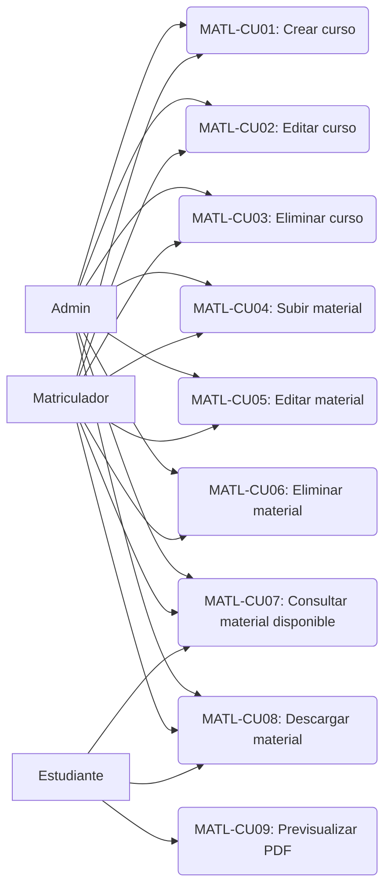

### MATL-CU01: Crear curso
**Actores:** Admin, Matriculador
**Precondicion:** Usuario autenticado.
**Postcondicion:** Course + CourseModality.
**Flujo Principal:**
1. "Crear curso".
2. Nombre, codigo, descripcion.
3. Modalidades.
4. Opcional: imagen.
5. Valida codigo unico.
6. Crea.
**FA (Codigo duplicado):** Error.

### MATL-CU02: Editar curso
**Actores:** Admin, Matriculador
**Flujo Principal:** Selecciona, modifica, guarda.

### MATL-CU03: Eliminar curso
**Actores:** Admin, Matriculador
**Flujo Principal:** Confirma, elimina en cascada.

### MATL-CU04: Subir material
**Actores:** Admin, Matriculador
**Flujo Principal:**
1. Selecciona curso.
2. "Subir material".
3. Archivo, nombre, descripcion.
4. Almacena.

### MATL-CU05: Editar material
**Actores:** Admin, Matriculador
**Flujo Principal:** Modifica, guarda.

### MATL-CU06: Eliminar material
**Actores:** Admin, Matriculador
**Flujo Principal:** Confirma, elimina archivo.

### MATL-CU07: Consultar material disponible
**Actores:** Admin, Matriculador, Estudiante
**Flujo Principal:**
1. "Material de Cursos".
2. Admin/Matriculador: todos.
   Estudiante: solo su modalidad.

### MATL-CU08: Descargar material
**Actores:** Admin, Matriculador, Estudiante
**Flujo Principal:** Clic, verifica permiso, descarga.

### MATL-CU09: Previsualizar PDF
**Actores:** Estudiante
**Flujo Principal:** "Previsualizar", visor integrado.

---

## MODULO: PERFIL (PRF)

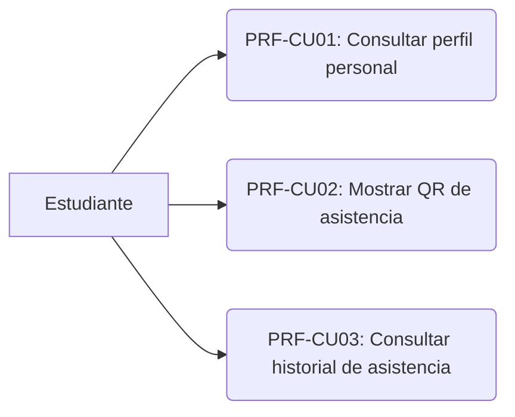

### PRF-CU01: Consultar perfil personal
**Actores:** Estudiante
**Flujo Principal:**
1. "Mi Perfil".
2. Datos personales, academicos, foto, QR, historial.

### PRF-CU02: Mostrar QR de asistencia
**Actores:** Estudiante
**Flujo Principal:**
1. En perfil.
2. QR con ID.
3. Ampliable.

### PRF-CU03: Consultar historial de asistencia
**Actores:** Estudiante
**Flujo Principal:**
1. En perfil.
2. Ultimos registros.
**FA (Ver completo):** Redirige a HPA-CU01.

---

## MODULO: CARNETS ACADEMICOS (CAR)

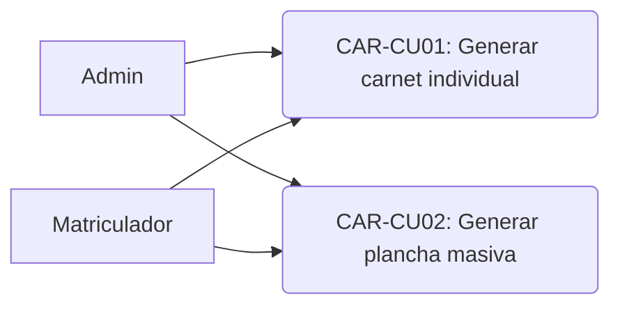

### CAR-CU01: Generar carnet individual
**Actores:** Admin, Matriculador
**Flujo Principal:**
1. Detalle del estudiante.
2. "Generar carnet".
3. PDF con datos, foto, QR.

### CAR-CU02: Generar plancha masiva
**Actores:** Admin, Matriculador
**Flujo Principal:**
1. "Generar plancha".
2. PDF 8 carnets/hoja A4, frente y reverso.

---

## MODULO: IMPORTACION MASIVA POR EXCEL (IMP)

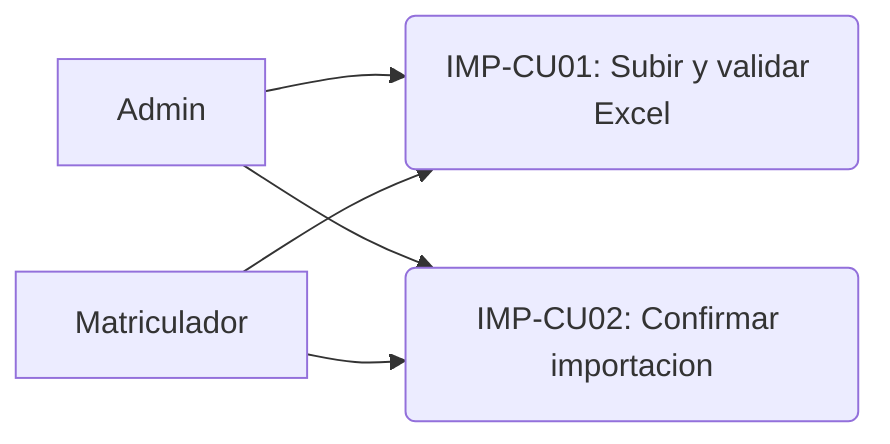

### IMP-CU01: Subir y validar archivo Excel
**Actores:** Admin, Matriculador
**Precondicion:** Ciclo activo en periodo operable.
**Postcondicion:** Preview.
**Flujo Principal:**
1. Abre modal.
2. Sube Excel.
3. Backend valida encabezados.
4. Procesa filas: DNI, email, modalidad, grupo, pagos.
5. Preview: validas, errores, recurrentes.
**FA (Encabezados invalidos):** Error.

### IMP-CU02: Confirmar importacion masiva
**Actores:** Admin, Matriculador
**Precondicion:** Preview con validas.
**Postcondicion:** Users, perfiles, matriculas creados.
**Flujo Principal:**
1. Revisa preview.
2. Confirma.
3. Transaccion atomica.
4. Resumen.
**FA (Error):** Reversion.
**FA (Cancelacion):** Sin cambios.

---

## DIAGRAMA GENERAL DEL SISTEMA

```mermaid
graph LR
    Admin["Admin"]
    Matriculador["Matriculador"]
    Estudiante["Estudiante"]

    subgraph MATRICULA
        MAT1("MAT-CU01")
        MAT2("MAT-CU02")
        MAT3("MAT-CU03")
        MAT4("MAT-CU04")
        MAT5("MAT-CU05")
        MAT6("MAT-CU06")
        MAT7("MAT-CU07")
    end
    subgraph CICLOS
        C1("CIC-CU01")
        C2("CIC-CU02")
        C3("CIC-CU03")
    end
    subgraph PAGOS
        P1("PAG-CU01")
        P2("PAG-CU02")
        P3("PAG-CU03")
        P4("PAG-CU04")
        P5("PAG-CU05")
    end
    subgraph USUARIOS
        U1("USR-CU01")
        U2("USR-CU02")
        U3("USR-CU03")
    end
    subgraph ASISTENCIA
        A1("ASIS-CU01")
        A2("ASIS-CU02")
        A3("ASIS-CU03")
        A4("ASIS-CU04")
        A5("ASIS-CU05")
        A6("ASIS-CU06")
    end
    subgraph SIMULACROS
        S1("SIM-CU01")
        S2("SIM-CU02")
        S3("SIM-CU03")
        S4("SIM-CU04")
        S5("SIM-CU05")
        S6("SIM-CU06")
        S7("SIM-CU07")
        S8("SIM-CU08")
        S9("SIM-CU09")
    end
    subgraph MATERIALES
        L1("MATL-CU01")
        L2("MATL-CU02")
        L3("MATL-CU03")
        L4("MATL-CU04")
        L5("MATL-CU05")
        L6("MATL-CU06")
        L7("MATL-CU07")
        L8("MATL-CU08")
        L9("MATL-CU09")
    end
    subgraph ESTUDIANTE
        H1("HPA-CU01")
        H2("HPA-CU02")
        R1("RES-CU01")
        F1("PRF-CU01")
        F2("PRF-CU02")
        F3("PRF-CU03")
    end
    subgraph CARNETS
        K1("CAR-CU01")
        K2("CAR-CU02")
    end
    subgraph IMPORTACION
        I1("IMP-CU01")
        I2("IMP-CU02")
    end

    Admin --> MAT1 Admin --> MAT2 Admin --> MAT3 Admin --> MAT4 Admin --> MAT5 Admin --> MAT6 Admin --> MAT7
    Admin --> C1 Admin --> C2 Admin --> C3
    Admin --> P1 Admin --> P2 Admin --> P3 Admin --> P4 Admin --> P5
    Admin --> U1 Admin --> U2 Admin --> U3
    Admin --> A1 Admin --> A2 Admin --> A3 Admin --> A4 Admin --> A5 Admin --> A6
    Admin --> S1 Admin --> S2 Admin --> S3 Admin --> S4 Admin --> S5 Admin --> S6 Admin --> S7 Admin --> S8 Admin --> S9
    Admin --> L1 Admin --> L2 Admin --> L3 Admin --> L4 Admin --> L5 Admin --> L6 Admin --> L7 Admin --> L8
    Admin --> K1 Admin --> K2
    Admin --> I1 Admin --> I2

    Matriculador --> MAT1 Matriculador --> MAT2 Matriculador --> MAT3 Matriculador --> MAT4 Matriculador --> MAT5 Matriculador --> MAT6 Matriculador --> MAT7
    Matriculador --> C1 Matriculador --> C2 Matriculador --> C3
    Matriculador --> P1 Matriculador --> P2 Matriculador --> P3 Matriculador --> P4 Matriculador --> P5
    Matriculador --> U1 Matriculador --> U2 Matriculador --> U3
    Matriculador --> A1 Matriculador --> A2 Matriculador --> A3 Matriculador --> A4 Matriculador --> A5 Matriculador --> A6
    Matriculador --> S1 Matriculador --> S2 Matriculador --> S3 Matriculador --> S4 Matriculador --> S5 Matriculador --> S6 Matriculador --> S7 Matriculador --> S9
    Matriculador --> L1 Matriculador --> L2 Matriculador --> L3 Matriculador --> L4 Matriculador --> L5 Matriculador --> L6 Matriculador --> L7 Matriculador --> L8
    Matriculador --> K1 Matriculador --> K2
    Matriculador --> I1 Matriculador --> I2

    Estudiante --> H1 Estudiante --> H2 Estudiante --> R1 Estudiante --> F1 Estudiante --> F2 Estudiante --> F3
    Estudiante --> L7 Estudiante --> L8 Estudiante --> L9
```

---

## RESUMEN

| Modulo | ID | Casos de Uso |
|--------|----|:------------:|
| Matricula | MAT | 7 |
| Gestion de Ciclos | CIC | 3 |
| Pagos | PAG | 5 |
| Usuarios | USR | 3 |
| Asistencia Administrativa | ASIS | 6 |
| Historial Personal Asistencia | HPA | 2 |
| Simulacros | SIM | 9 |
| Resultados Estudiante | RES | 1 |
| Material de Cursos | MATL | 9 |
| Perfil | PRF | 3 |
| Carnets Academicos | CAR | 2 |
| Importacion Masiva Excel | IMP | 2 |
| **TOTAL** | | **52** |
