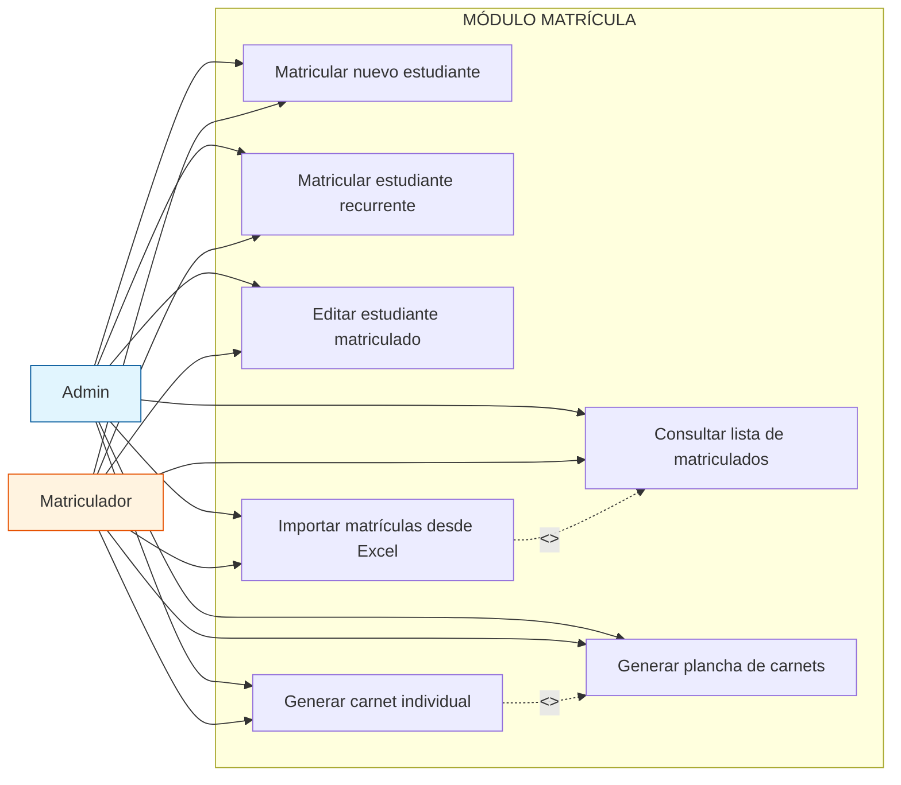
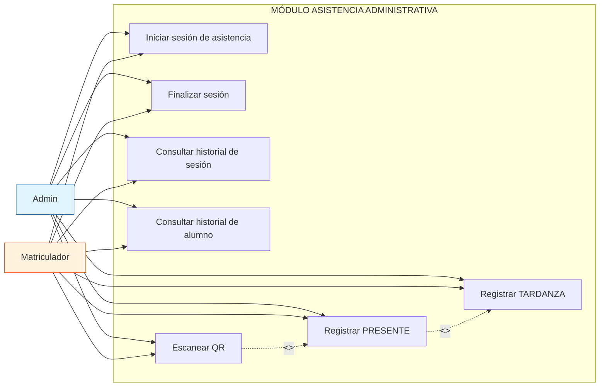
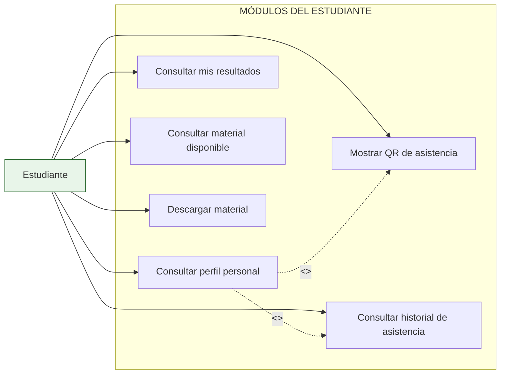
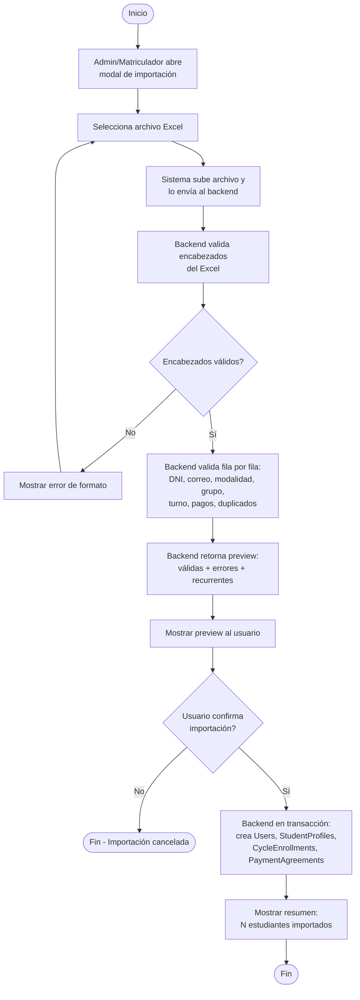
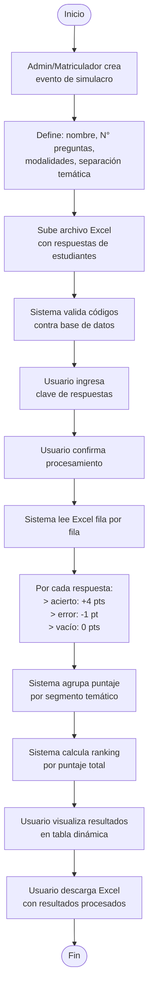

# DIAGRAMAS - SISTEMA INTRANET ADUNI VALLEJO
## Formato: Mermaid (renderizable en VS Code, GitHub, Notion, etc.)

---

## 1. DIAGRAMA GENERAL DE CASOS DE USO

```mermaid
graph TD
    subgraph "SISTEMA INTRANET ADUNI VALLEJO"
        
        subgraph "ADMINISTRATIVO"
            UC1[Matricular nuevo estudiante]
            UC2[Matricular estudiante recurrente]
            UC3[Editar estudiante matriculado]
            UC4[Consultar lista de matriculados]
            UC5[Importar matrículas desde Excel]
            UC6[Generar plancha de carnets]
            UC7[Crear ciclo académico]
            UC8[Seleccionar ciclo activo]
            UC9[Consultar deuda de estudiante]
            UC10[Registrar pago]
            UC11[Consultar historial de pagos]
            UC12[Retirar / Reactivar estudiante]
            UC13[Consultar estudiantes por ciclo]
            UC14[Iniciar sesión de asistencia]
            UC15[Registrar presente / tardanza]
            UC16[Finalizar sesión de asistencia]
            UC17[Consultar historial de sesión]
            UC18[Crear evento de simulacro]
            UC19[Validar archivo de simulacro]
            UC20[Ingresar respuestas correctas]
            UC21[Procesar resultados]
            UC22[Crear curso]
            UC23[Subir material educativo]
            UC24[Consultar material disponible]
            UC25[Descargar material]
        end
        
        subgraph "ESTUDIANTE"
            UC26[Consultar perfil personal]
            UC27[Mostrar QR de asistencia]
            UC28[Consultar historial de asistencia]
            UC29[Consultar mis resultados]
        end
        
    end

    Admin -->|gestiona| UC1
    Admin -->|gestiona| UC2
    Admin -->|gestiona| UC3
    Admin -->|gestiona| UC4
    Admin -->|gestiona| UC5
    Admin -->|gestiona| UC6
    Admin -->|gestiona| UC7
    Admin -->|gestiona| UC8
    Admin -->|gestiona| UC9
    Admin -->|gestiona| UC10
    Admin -->|gestiona| UC11
    Admin -->|gestiona| UC12
    Admin -->|gestiona| UC13
    Admin -->|gestiona| UC14
    Admin -->|gestiona| UC15
    Admin -->|gestiona| UC16
    Admin -->|gestiona| UC17
    Admin -->|gestiona| UC18
    Admin -->|gestiona| UC19
    Admin -->|gestiona| UC20
    Admin -->|gestiona| UC21
    Admin -->|gestiona| UC22
    Admin -->|gestiona| UC23

    Matriculador -->|opera| UC1
    Matriculador -->|opera| UC2
    Matriculador -->|opera| UC3
    Matriculador -->|opera| UC4
    Matriculador -->|opera| UC5
    Matriculador -->|opera| UC6
    Matriculador -->|opera| UC7
    Matriculador -->|opera| UC8
    Matriculador -->|opera| UC9
    Matriculador -->|opera| UC10
    Matriculador -->|opera| UC11
    Matriculador -->|opera| UC12
    Matriculador -->|opera| UC13
    Matriculador -->|opera| UC14
    Matriculador -->|opera| UC15
    Matriculador -->|opera| UC16
    Matriculador -->|opera| UC17
    Matriculador -->|opera| UC18
    Matriculador -->|opera| UC19
    Matriculador -->|opera| UC20
    Matriculador -->|opera| UC21
    Matriculador -->|opera| UC22
    Matriculador -->|opera| UC23

    Estudiante -->|consulta| UC24
    Estudiante -->|consulta| UC25
    Estudiante -->|consulta| UC26
    Estudiante -->|consulta| UC27
    Estudiante -->|consulta| UC28
    Estudiante -->|consulta| UC29

    classDef admin fill:#e1f5fe,stroke:#01579b
    classDef matriculador fill:#fff3e0,stroke:#e65100
    classDef estudiante fill:#e8f5e9,stroke:#1b5e20
    class Admin admin
    class Matriculador matriculador
    class Estudiante estudiante
```



---

## 2. DIAGRAMA DE CASOS DE USO - MATRÍCULA



---

## 3. DIAGRAMA DE CASOS DE USO - ASISTENCIA



---

## 4. DIAGRAMA DE CASOS DE USO - ESTUDIANTE



---

## 5. DIAGRAMA DE ACTIVIDAD: MATRICULAR NUEVO ESTUDIANTE

```mermaid
flowchart TD
    A([Inicio]) --> B[Admin/Matriculador selecciona ciclo activo]
    B --> C{Sistema verifica ciclo<br>en periodo operable?}
    C -->|No| D[Mostrar error:<br>Ciclo fuera de periodo]
    D --> E([Fin])
    C -->|Sí| F[Usuario hace clic en<br>"Nuevo Estudiante"]
    F --> G[Mostrar formulario:<br>Datos personales, académicos, apoderado]
    G --> H[Usuario ingresa datos]
    H --> I[Usuario registra DNI de 8 dígitos]
    I --> J{Sistema valida DNI<br>ya existe como User?}
    J -->|Sí, existe| K[Sistema recupera User existente]
    K --> L{Usuario ya matriculado<br>en este ciclo?}
    L -->|Sí| M[Mostrar error:<br>Estudiante ya matriculado]
    M --> E
    L -->|No| N[Sistema crea CycleEnrollment]
    J -->|No| O[Sistema crea: User + StudentProfile]
    O --> N
    N --> P{Se registró pago inicial?}
    P -->|Sí| Q[Sistema crea PaymentAgreement<br>+ PaymentTransaction]
    P -->|No| R[Sistema crea PaymentAgreement<br>sin pago inicial]
    Q --> S([Fin - Estudiante matriculado])
    R --> S
```

---

## 6. DIAGRAMA DE ACTIVIDAD: IMPORTAR MATRÍCULAS DESDE EXCEL



---

## 7. DIAGRAMA DE ACTIVIDAD: REGISTRAR PAGO

```mermaid
flowchart TD
    A([Inicio]) --> B[Admin/Matriculador busca<br>estudiante por DNI]
    B --> C[Sistema muestra resumen financiero:<br>total, inicial, saldo, cuotas]
    C --> D[Usuario selecciona<br>"Registrar pago"]
    D --> E[Usuario ingresa:<br>monto + número de recibo]
    E --> F{Sistema autocompleta<br>recibo a 8 dígitos}
    F --> G{Monto válido?}
    G -->|No| H[Mostrar error de validación]
    H --> E
    G -->|Sí| I[Sistema registra PaymentTransaction]
    I --> J[Sistema actualiza<br>currentPendingAmount]
    J --> K[Sistema actualiza cuotas<br>PENDING → PAID según monto]
    K --> L[Mostrar comprobante<br>de pago registrado]
    L --> M([Fin])
```

---

## 8. DIAGRAMA DE ACTIVIDAD: INICIAR Y CERRAR SESIÓN DE ASISTENCIA

```mermaid
flowchart TD
    A([Inicio]) --> B[Admin/Matriculador selecciona<br>"Nueva sesión de asistencia"]
    B --> C[Sistema crea AttendanceSession<br>con hora de inicio]
    C --> D[Se muestra lista de estudiantes<br>del ciclo activo]
    D --> E{Sesión en curso}
    E --> F[Usuario escanea QR<br>o registra manualmente]
    F --> G[Sistema registra AttendanceRecord<br>con estado PRESENT]
    G --> H{Es tardanza?}
    H -->|Sí| I[Usuario cambia estado a LATE]
    H -->|No| J[Reproducir sonido de éxito]
    I --> J
    J --> K{Queda tiempo<br>de sesión?}
    K -->|Sí| E
    K -->|No| L[Usuario finaliza sesión]
    L --> M[Sistema marca no registrados<br>como ABSENT]
    M --> N([Fin - Sesión cerrada])
```

---

## 9. DIAGRAMA DE ACTIVIDAD: PROCESAR SIMULACRO



---

## 10. MATRIZ DE FRECUENCIA DE USO

```mermaid
graph LR
    subgraph "FRECUENCIA DE USO ESTIMADA"
        direction TB
        F1[MATRÍCULA: Alta - diaria durante campaña]
        F2[PAGOS: Alta - diaria durante campaña]
        F3[ASISTENCIA: Alta - cada sesión de clase]
        F4[CICLOS: Baja - solo al iniciar periodo]
        F5[USUARIOS: Media - consultas frecuentes]
        F6[SIMULACROS: Media - por evento programado]
        F7[MATERIALES: Media - subida semanal]
        F8[IMPORTACIÓN: Baja - migración única]
        F9[CARNETS: Baja - una vez por ciclo]
        F10[PERFIL EST: Alta - consulta diaria]
        F11[RESULTADOS: Media - post simulacro]
        F12[HISTORIAL ASIS: Media - consultas frecuentes]
    end

    classDef alta fill:#ffcdd2,stroke:#c62828
    classDef media fill:#fff9c4,stroke:#f57f17
    classDef baja fill:#c8e6c9,stroke:#2e7d32
    class F1,F2,F3,F10 alta
    class F5,F6,F7,F11,F12 media
    class F4,F8,F9 baja
```



---

## 11. TABLA DE FRECUENCIA (para diagrama de barras)

| Módulo | Frecuencia | Tipo de Actor | Momento de Uso |
|--------|:----------:|:-------------:|----------------|
| Matrícula | 🔴 Alta | Admin, Matriculador | Diario en campaña |
| Pagos | 🔴 Alta | Admin, Matriculador | Diario en campaña |
| Asistencia | 🔴 Alta | Admin, Matriculador | Cada sesión de clase |
| Perfil Est. | 🔴 Alta | Estudiante | Consulta diaria |
| Usuarios | 🟡 Media | Admin, Matriculador | Consultas frecuentes |
| Simulacros | 🟡 Media | Admin, Matriculador | Por evento programado |
| Materiales | 🟡 Media | Admin, Matriculador, Est. | Subida semanal / consulta diaria |
| Resultados | 🟡 Media | Estudiante | Post simulacro |
| Historial Asis. | 🟡 Media | Estudiante | Consultas frecuentes |
| Ciclos | 🟢 Baja | Admin, Matriculador | Solo al iniciar periodo |
| Importación Excel | 🟢 Baja | Admin, Matriculador | Migración única |
| Carnets | 🟢 Baja | Admin, Matriculador | Una vez por ciclo |

---

## NOTAS PARA EL DIAGRAMADOR

1. **Los diagramas Mermaid** se renderizan automáticamente en:
   - VS Code (extensión Mermaid)
   - GitHub (`.md` files)
   - Notion
   - GitLab
   - https://mermaid.live (editor online)

2. **Para diagramas UML formales**, usa PlantUML (formato alternativo abajo)

3. **Incluir/Extender:**
   - `<<include>>`: el caso base SIEMPRE incluye al otro
   - `<<extend>>`: el caso base PUEDE extenderse opcionalmente

4. **Frecuencia:**
   - 🔴 Alta uso → crítica para el negocio
   - 🟡 Medio uso → operativa estándar
   - 🟢 Bajo uso → configuración/mantenimiento
