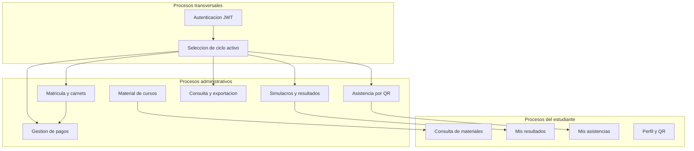
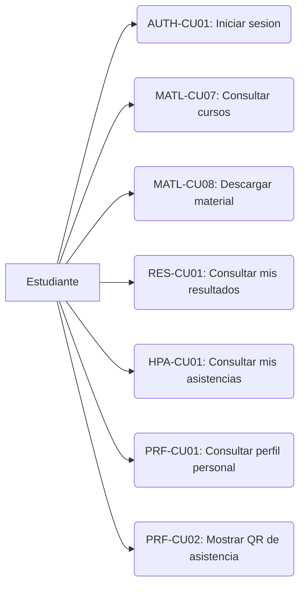
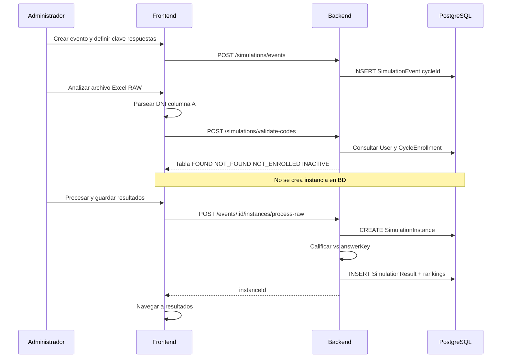
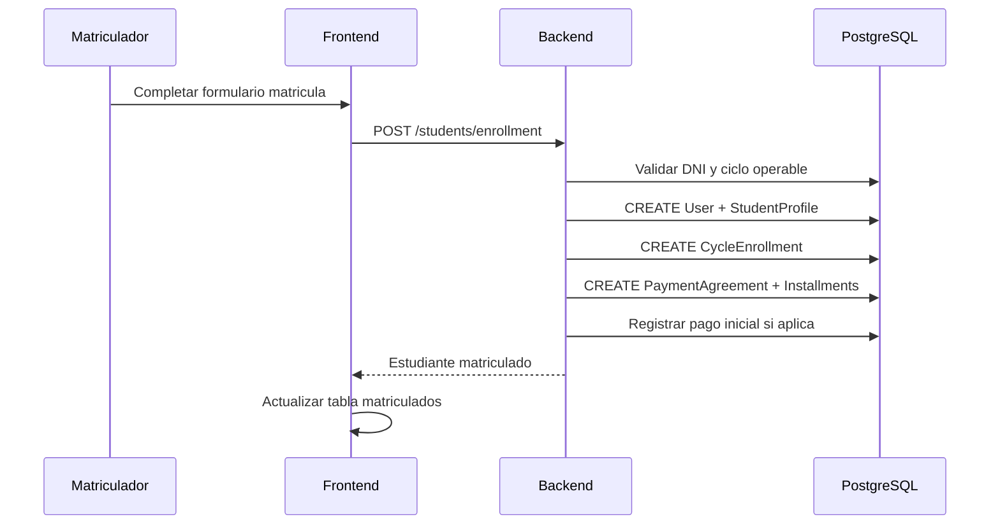
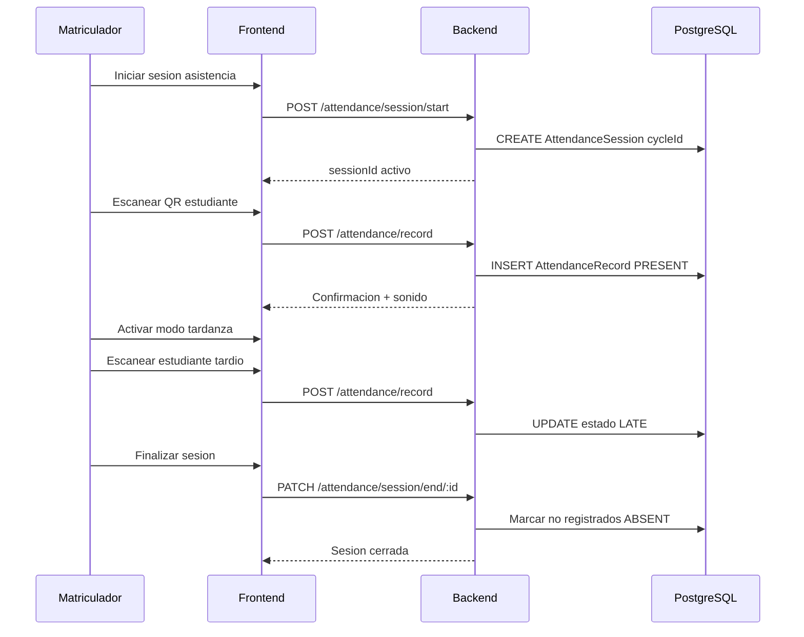

# 9.3 Modelamiento del sistema

**Sistema:** Intranet academica ADUNI Vallejo  
**Version documentada:** 2026  
**Referencia estructural:** portalWeb-v1.10 (seccion 9.3, Tablas 6 y 7)  
**Fuente tecnica:** codigo en repositorio `INTRANET VALLEJO`

---

## 9.3.1 Modelo del sistema / mapa de procesos

El sistema academico ADUNI Vallejo es una aplicacion web cliente-servidor (React + Node.js/Express + PostgreSQL/Prisma) que centraliza la operacion academica y administrativa por **ciclo lectivo**. Los procesos principales son:

**Nota sobre roles internos:** el sistema incluye el rol `kami` (superusuario operativo). Para la documentacion de tesis se modelan solo los tres actores principales: **Administrador**, **Matriculador** y **Estudiante**.

---

## 9.3.2 Tabla 6. Actores del sistema

| Actor | Descripcion |
|-------|-------------|
| **Administrador** | Actor interno con supervision total de la plataforma. Gestiona matricula, ciclos, pagos, usuarios, asistencia administrativa, simulacros, material de cursos, carnets e importacion masiva por Excel. Puede eliminar eventos e instancias de simulacro y crear usuarios con rol administrador. |
| **Matriculador** | Actor interno de operacion academica diaria. Comparte con el administrador el acceso a matricula, ciclos, pagos, usuarios, asistencia, simulacros, materiales, carnets e importacion Excel. No puede eliminar eventos/instancias de simulacro en la interfaz ni crear usuarios administradores. |
| **Estudiante** | Actor externo matriculado. Consulta material de cursos permitido por modalidad, sus resultados de simulacros, su perfil personal con codigo QR de asistencia y su historial personal de asistencia. No accede a modulos administrativos. |

*Fuente: elaboracion propia (sistema ADUNI Vallejo, 2026).*

---

## 9.3.3 Diagramas de Caso de Uso del sistema

### Figura 30. Caso de Uso del Sistema: Administrador

```mermaid
graph LR
  Admin["Administrador"]

  AUTH1("AUTH-CU01: Iniciar sesion")
  CIC1("CIC-CU01: Crear ciclo academico")
  CIC2("CIC-CU02: Seleccionar ciclo activo")
  MAT2("MAT-CU02: Matricular nuevo estudiante")
  MAT3("MAT-CU03: Matricular estudiante recurrente")
  MAT4("MAT-CU04: Editar estudiante")
  MAT5("MAT-CU05: Consultar matriculados")
  MAT7("MAT-CU07: Generar plancha carnets")
  IMP1("IMP-CU01: Validar Excel masivo")
  IMP2("IMP-CU02: Confirmar importacion masiva")
  PAG1("PAG-CU01: Dashboard pagos del ciclo")
  PAG2("PAG-CU02: Buscar alumno para pago")
  PAG3("PAG-CU03: Registrar pago o descuento")
  PAG4("PAG-CU04: Retirar o reactivar estudiante")
  USR1("USR-CU01: Consultar usuarios por ciclo")
  USR2("USR-CU02: Filtrar con deuda")
  USR3("USR-CU03: Exportar listado")
  USR4("USR-CU04: Crear usuario staff")
  ASIS1("ASIS-CU01: Iniciar sesion asistencia")
  ASIS2("ASIS-CU02: Registrar presente")
  ASIS3("ASIS-CU03: Registrar tardanza")
  ASIS4("ASIS-CU04: Finalizar sesion")
  ASIS5("ASIS-CU05: Consultar historial sesion")
  ASIS6("ASIS-CU06: Historial alumno")
  SIM1("SIM-CU01: Crear evento simulacro")
  SIM2("SIM-CU02: Analizar archivo RAW")
  SIM3("SIM-CU03: Procesar resultados RAW")
  SIM4("SIM-CU04: Importar PROCESSED")
  SIM5("SIM-CU05: Ver y exportar resultados")
  SIM6("SIM-CU06: Eliminar evento o instancia")
  MATL1("MATL-CU01: Crear curso")
  MATL2("MATL-CU02: Editar curso")
  MATL3("MATL-CU03: Eliminar curso")
  MATL4("MATL-CU04: Subir material")
  CAR1("CAR-CU01: Carnet individual")
  CAR2("CAR-CU02: Plancha masiva carnets")

  Admin --> AUTH1
  Admin --> CIC1
  Admin --> CIC2
  Admin --> MAT2
  Admin --> MAT3
  Admin --> MAT4
  Admin --> MAT5
  Admin --> MAT7
  Admin --> IMP1
  Admin --> IMP2
  Admin --> PAG1
  Admin --> PAG2
  Admin --> PAG3
  Admin --> PAG4
  Admin --> USR1
  Admin --> USR2
  Admin --> USR3
  Admin --> USR4
  Admin --> ASIS1
  Admin --> ASIS2
  Admin --> ASIS3
  Admin --> ASIS4
  Admin --> ASIS5
  Admin --> ASIS6
  Admin --> SIM1
  Admin --> SIM2
  Admin --> SIM3
  Admin --> SIM4
  Admin --> SIM5
  Admin --> SIM6
  Admin --> MATL1
  Admin --> MATL2
  Admin --> MATL3
  Admin --> MATL4
  Admin --> CAR1
  Admin --> CAR2
```

### Figura 31. Caso de Uso del Sistema: Matriculador

```mermaid
graph LR
  Matriculador["Matriculador"]

  AUTH1("AUTH-CU01: Iniciar sesion")
  CIC1("CIC-CU01: Crear ciclo academico")
  CIC2("CIC-CU02: Seleccionar ciclo activo")
  MAT2("MAT-CU02: Matricular nuevo estudiante")
  MAT3("MAT-CU03: Matricular estudiante recurrente")
  MAT4("MAT-CU04: Editar estudiante")
  MAT5("MAT-CU05: Consultar matriculados")
  MAT7("MAT-CU07: Generar plancha carnets")
  IMP1("IMP-CU01: Validar Excel masivo")
  IMP2("IMP-CU02: Confirmar importacion masiva")
  PAG1("PAG-CU01: Dashboard pagos del ciclo")
  PAG2("PAG-CU02: Buscar alumno para pago")
  PAG3("PAG-CU03: Registrar pago o descuento")
  PAG4("PAG-CU04: Retirar o reactivar estudiante")
  USR1("USR-CU01: Consultar usuarios por ciclo")
  USR2("USR-CU02: Filtrar con deuda")
  USR3("USR-CU03: Exportar listado")
  ASIS1("ASIS-CU01: Iniciar sesion asistencia")
  ASIS2("ASIS-CU02: Registrar presente")
  ASIS3("ASIS-CU03: Registrar tardanza")
  ASIS4("ASIS-CU04: Finalizar sesion")
  ASIS5("ASIS-CU05: Consultar historial sesion")
  ASIS6("ASIS-CU06: Historial alumno")
  SIM1("SIM-CU01: Crear evento simulacro")
  SIM2("SIM-CU02: Analizar archivo RAW")
  SIM3("SIM-CU03: Procesar resultados RAW")
  SIM4("SIM-CU04: Importar PROCESSED")
  SIM5("SIM-CU05: Ver y exportar resultados")
  MATL1("MATL-CU01: Crear curso")
  MATL2("MATL-CU02: Editar curso")
  MATL3("MATL-CU03: Eliminar curso")
  MATL4("MATL-CU04: Subir material")
  CAR1("CAR-CU01: Carnet individual")
  CAR2("CAR-CU02: Plancha masiva carnets")

  Matriculador --> AUTH1
  Matriculador --> CIC1
  Matriculador --> CIC2
  Matriculador --> MAT2
  Matriculador --> MAT3
  Matriculador --> MAT4
  Matriculador --> MAT5
  Matriculador --> MAT7
  Matriculador --> IMP1
  Matriculador --> IMP2
  Matriculador --> PAG1
  Matriculador --> PAG2
  Matriculador --> PAG3
  Matriculador --> PAG4
  Matriculador --> USR1
  Matriculador --> USR2
  Matriculador --> USR3
  Matriculador --> ASIS1
  Matriculador --> ASIS2
  Matriculador --> ASIS3
  Matriculador --> ASIS4
  Matriculador --> ASIS5
  Matriculador --> ASIS6
  Matriculador --> SIM1
  Matriculador --> SIM2
  Matriculador --> SIM3
  Matriculador --> SIM4
  Matriculador --> SIM5
  Matriculador --> MATL1
  Matriculador --> MATL2
  Matriculador --> MATL3
  Matriculador --> MATL4
  Matriculador --> CAR1
  Matriculador --> CAR2
```

### Figura 29. Caso de Uso del Sistema: Estudiante

*Fuente: elaboracion propia (herramienta Mermaid / sistema ADUNI Vallejo, 2026).*

---

## 9.3.4 Indice de casos de uso del sistema

| ID | Caso de uso | Actores | Modulo |
|----|-------------|---------|--------|
| AUTH-CU01 | Iniciar sesion | Admin, Matriculador, Estudiante | Autenticacion |
| CIC-CU01 | Crear ciclo academico | Admin, Matriculador | Ciclos |
| CIC-CU02 | Seleccionar ciclo activo | Admin, Matriculador | Ciclos |
| MAT-CU02 | Matricular nuevo estudiante | Admin, Matriculador | Matricula |
| MAT-CU03 | Matricular estudiante recurrente | Admin, Matriculador | Matricula |
| MAT-CU04 | Editar estudiante matriculado | Admin, Matriculador | Matricula |
| MAT-CU05 | Consultar lista de matriculados | Admin, Matriculador | Matricula |
| MAT-CU07 | Generar plancha de carnets | Admin, Matriculador | Carnets |
| IMP-CU01 | Validar archivo Excel masivo | Admin, Matriculador | Importacion |
| IMP-CU02 | Confirmar importacion masiva | Admin, Matriculador | Importacion |
| PAG-CU01 | Consultar dashboard de pagos | Admin, Matriculador | Pagos |
| PAG-CU02 | Buscar alumno para pago | Admin, Matriculador | Pagos |
| PAG-CU03 | Registrar pago o descuento | Admin, Matriculador | Pagos |
| PAG-CU04 | Retirar o reactivar estudiante | Admin, Matriculador | Pagos |
| USR-CU01 | Consultar estudiantes por ciclo | Admin, Matriculador | Usuarios |
| USR-CU02 | Filtrar estudiantes con deuda | Admin, Matriculador | Usuarios |
| USR-CU03 | Exportar listado PDF/Excel | Admin, Matriculador | Usuarios |
| USR-CU04 | Crear usuario staff | Admin | Usuarios |
| ASIS-CU01 | Iniciar sesion de asistencia | Admin, Matriculador | Asistencia |
| ASIS-CU02 | Registrar presente | Admin, Matriculador | Asistencia |
| ASIS-CU03 | Registrar tardanza | Admin, Matriculador | Asistencia |
| ASIS-CU04 | Finalizar sesion | Admin, Matriculador | Asistencia |
| ASIS-CU05 | Consultar historial de sesion | Admin, Matriculador | Asistencia |
| ASIS-CU06 | Consultar historial de alumno | Admin, Matriculador | Asistencia |
| SIM-CU01 | Crear evento de simulacro | Admin, Matriculador | Simulacros |
| SIM-CU02 | Analizar archivo RAW | Admin, Matriculador | Simulacros |
| SIM-CU03 | Procesar resultados RAW | Admin, Matriculador | Simulacros |
| SIM-CU04 | Importar resultados PROCESSED | Admin, Matriculador | Simulacros |
| SIM-CU05 | Ver y exportar resultados | Admin, Matriculador | Simulacros |
| SIM-CU06 | Eliminar evento o instancia | Admin | Simulacros |
| MATL-CU01 | Crear curso | Admin, Matriculador | Materiales |
| MATL-CU02 | Editar curso | Admin, Matriculador | Materiales |
| MATL-CU03 | Eliminar curso | Admin, Matriculador | Materiales |
| MATL-CU04 | Subir material | Admin, Matriculador | Materiales |
| MATL-CU07 | Consultar cursos disponibles | Estudiante | Materiales |
| MATL-CU08 | Descargar material | Estudiante | Materiales |
| RES-CU01 | Consultar mis resultados | Estudiante | Resultados |
| HPA-CU01 | Consultar mis asistencias | Estudiante | Asistencia personal |
| PRF-CU01 | Consultar perfil personal | Estudiante | Perfil |
| PRF-CU02 | Mostrar QR de asistencia | Estudiante | Perfil |

---

## 9.3.5 Documentacion del flujo de eventos

Las tablas detalladas por actor se encuentran en:

- [Tabla 7 - Administrador](../bocectos_adva/9.3/flujo_eventos_admin.md)
- [Tabla 8 - Matriculador](../bocectos_adva/9.3/flujo_eventos_matriculador.md)
- [Tabla 9 - Estudiante](../bocectos_adva/9.3/flujo_eventos_estudiante.md)

Resumen integrado a continuacion.

---

### Tabla 7. Flujo de eventos — Administrador

Ver archivo exportable: `bocectos_adva/9.3/flujo_eventos_admin.md`

Escenarios documentados:
1. Autenticacion y seleccion de ciclo activo
2. Matricular estudiante nuevo
3. Importacion masiva por Excel
4. Gestion de pagos del ciclo
5. Sesion de asistencia administrativa
6. Simulacro RAW (analizar y procesar)
7. Simulacro PROCESSED (importacion directa)
8. Eliminar evento o instancia de simulacro
9. Gestion de material de cursos

---

### Tabla 8. Flujo de eventos — Matriculador

Ver archivo exportable: `bocectos_adva/9.3/flujo_eventos_matriculador.md`

Escenarios 1 a 7 y **9** identicos al administrador en operacion diaria. Escenario 8 (eliminacion de simulacros) excluido. Restriccion adicional: no puede crear usuarios con rol administrador.

---

### Tabla 9. Flujo de eventos — Estudiante

Ver archivo exportable: `bocectos_adva/9.3/flujo_eventos_estudiante.md`

Escenarios documentados:
1. Autenticacion y acceso al portal
2. Consultar y descargar materiales
3. Consultar mis resultados de simulacros
4. Consultar perfil y codigo QR
5. Consultar historial personal de asistencia

---

## Anexo A. Diagramas de secuencia (flujos criticos)

### A.1 Simulacro RAW — analizar y procesar

### A.2 Matricula con pago inicial

### A.3 Sesion de asistencia

*Fuente: elaboracion propia (sistema ADUNI Vallejo, 2026).*

---

## Anexo B. Deltas respecto a documentacion anterior

| Area | Documentacion previa | Sistema actual documentado |
|------|---------------------|---------------------------|
| Simulacros | Evento + modalidades; instancia vacia al analizar | Evento por ciclo; analisis sin BD; process-raw atomico |
| Pagos | Busqueda DNI simple | Dashboard KPIs + historial por dia + detalle alumno |
| Ciclo activo | Implicito | activeCycleId en Dashboard; prerequisito staff |
| Resultados estudiante | Generico | Filtrado por ciclos matriculados; 3 rankings |

---

*Fin seccion 9.3 — elaboracion propia, ADUNI Vallejo, 2026.*
