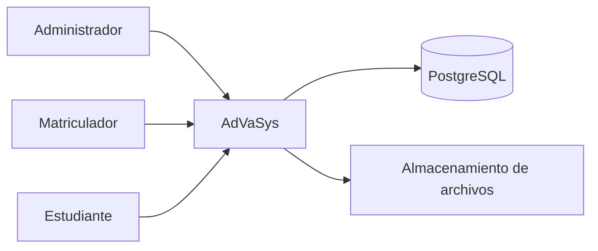
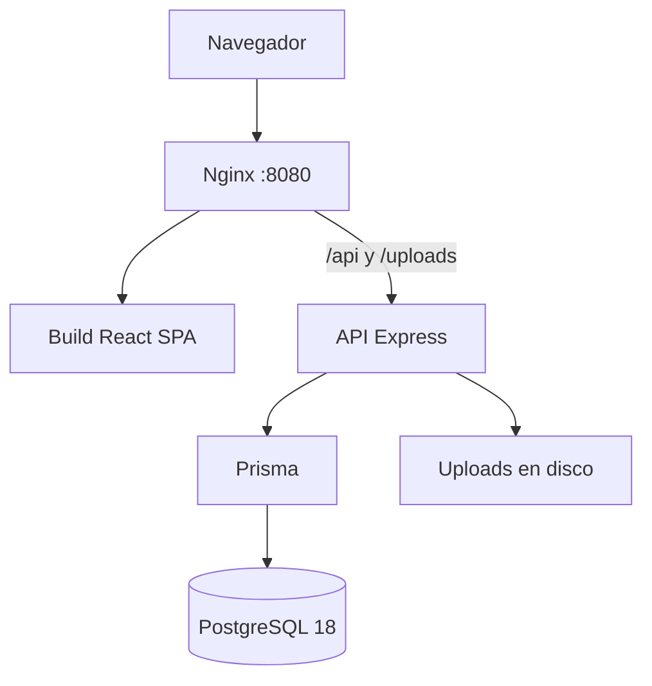
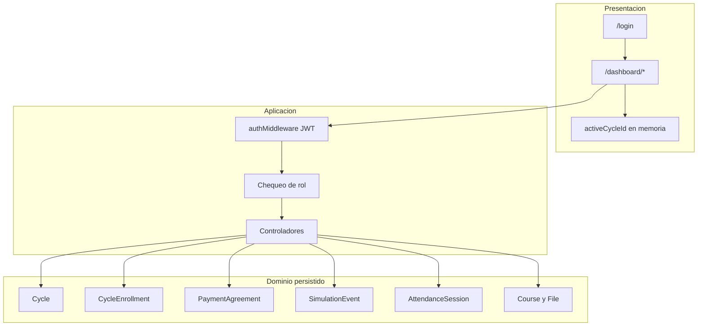
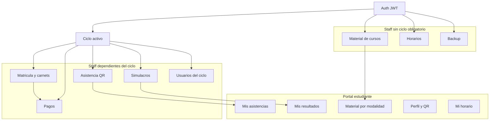
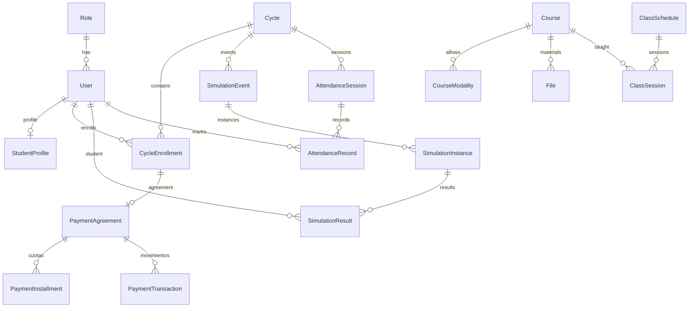
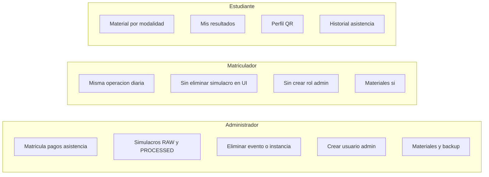
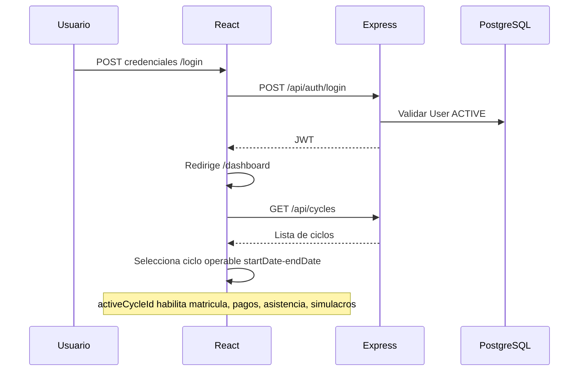

# Estructura grafica del sistema — Intranet academica ADUNI Vallejo (AdVaSys)

**Fuente:** codigo del repositorio (React 19, Express 5, Prisma 6, PostgreSQL 18).  
**Actores de tesis:** Administrador, Matriculador, Estudiante. El rol `kami` existe en codigo y no se modela como actor principal.

---

## 1. Contexto (sistema y actores)

---

## 2. Contenedores de despliegue

Flujo HTTP: el navegador carga la SPA; las llamadas `fetch` van a `/api/*` (JWT en `Authorization`). Nginx proxea hacia el backend. Archivos estaticos de portadas y fotos se sirven bajo `/uploads/...`.

---

## 3. Capas de software

---

## 4. Mapa de modulos (UI y API)

| Modulo | Ruta UI | Prefijo API |
|--------|---------|-------------|
| Login | `/login` | `/api/auth` |
| Matricula | `/dashboard/matricula` | `/api/students`, `/api/cycles` |
| Pagos | `/dashboard/pagos` | `/api/payments` |
| Usuarios | `/dashboard/usuarios` | `/api/users` |
| Asistencia | `/dashboard/asistencia` | `/api/attendance` |
| Simulacros | `/dashboard/simulacros` | `/api/simulations` |
| Cursos / material | `/dashboard/cursos` | `/api/courses`, `/api/materials` |
| Horarios | `/dashboard/horarios` | `/api/schedules` |
| Backup | `/dashboard/backup` | `/api/system/backup` |
| Mis resultados | `/dashboard/mis-resultados` | `/api/grades` |
| Mis asistencias | `/dashboard/mis-asistencias` | `/api/attendance/my-history` |
| Perfil | `/dashboard/perfil` | `/api/Perfil` |

---

## 5. Modelo de datos (agrupado)

Nucleo operativo: **Cycle** + **CycleEnrollment**. Pagos cuelgan de la matricula. Simulacros y asistencia se anclan al ciclo. Materiales (`Course`/`File`) son catalogo global filtrado por modalidad.

---

## 6. Acceso por actor

---

## 7. Flujo transversal: autenticacion y ciclo

---

*Elaboracion propia a partir del codigo de AdVaSys, 2026.*
